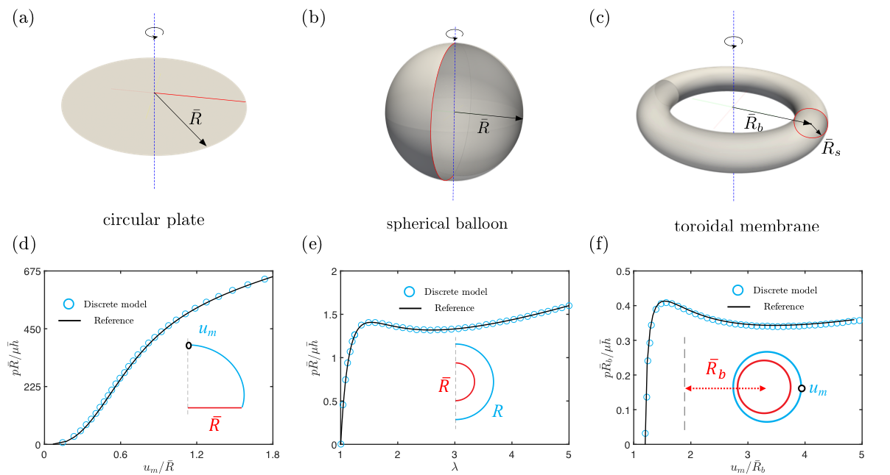
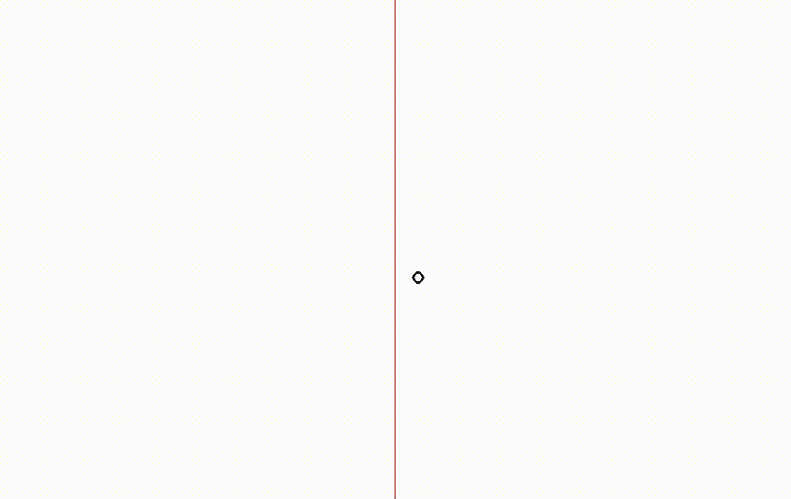

# A computational software for the axisymmetric dielectric elastomer membranes

# Overview

A discrete model for axisymmetric dielectric elastomer membranes.

 

 

# Make
g++ -I /usr/local/include/eigen-3.3.7/ main.cpp world.cpp setInput.cpp timeStepper.cpp inertialForce.cpp dampingForce.cpp elasticPlate.cpp externalPressureForce.cpp hyperElasticMM.cpp electricActuation.cpp -lGL -lglut -lGLU -L${MKLROOT}/lib/intel64 -Wl,--no-as-needed -lmkl_intel_lp64 -lmkl_intel_thread -lmkl_core -liomp5 -llapack -lgfortran -fopenmp -lpthread -lm -Ofast -o simDER

# Run 
./simDER option.txt
